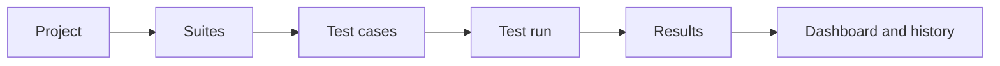

# Quick Start

This guide walks through the smallest useful Karvio workflow: create a project, add test cases, execute a run, record evidence, and review the result.

Use it for a local evaluation, an onboarding demo, or the first project setup after installation.

---

## Workflow at a Glance

---

## 1. Create a Project

Projects are the top-level containers for all testing work. Data, users, permissions, runs, attachments, and audit logs are scoped to a project.

1. Open **Projects** from the sidebar.
2. Click **New Project**.
3. Enter a **Name** and optional **Description**.
4. Click **Create**.

You are redirected to the project workspace. All subsequent work in this guide happens inside that project.

---

## 2. Add a Suite

Suites organize the case repository. Start with broad product areas, then add nested suites only when a section becomes hard to scan.

1. Go to **Test Cases**.
2. In the suite tree, click **New Suite**.
3. Name the suite after a stable feature area, for example `Authentication`.
4. Save the suite.

---

## 3. Create Test Cases

Create a small set of cases that prove the workflow before importing or writing the full repository.

1. Select the target suite.
2. Click **New Test Case**.
3. Fill in the core fields:

| Field | Example | Guidance |
|-------|---------|----------|
| **Name** | `User logs in with valid credentials` | Use a short behavior statement. |
| **Priority** | High | Set by business or release risk. |
| **Owner** | QA engineer or feature owner | Use for review and maintenance responsibility. |
| **Tags** | `smoke`, `auth`, `web` | Add stable filters, not one-off notes. |
| **Description** | Login with an active account should open the dashboard. | Include prerequisites and scope. |
| **Steps** | Action + expected result rows | Keep each step observable and verifiable. |

4. Click **Save**.

Repeat until you have at least three cases: one expected pass, one likely failure, and one edge case. This makes the run summary meaningful.

---

## 4. Create a Test Run

A test run is one execution of selected cases against a specific build and environment.

1. Go to **Test Runs**.
2. Click **New Test Run**.
3. Fill in the run details:

| Field | Example |
|-------|---------|
| **Name** | `Sprint 12 Smoke` |
| **Environment** | `Staging EU – Chrome` |
| **Milestone** | `Sprint 12` |
| **Build** | `web-2026.05.09.1` |
| **Description** | Smoke coverage before release candidate approval. |

4. Select the test cases to include.
5. Click **Create**.

---

## 5. Execute the Run

Open the run and work through each run item.

1. Click a run item to open the detail panel.
2. Review the case description, steps, and expected results.
3. Set the result status:
    – **Passed** when the observed behavior matches the expected result.
    – **Failed** when the behavior is wrong and should be triaged.
    – **Blocked** when execution cannot continue because of an external dependency.
    – **Not Applicable** when the case does not apply to this build or environment.
    – **In Progress** when execution has started but is not final.
4. Add a comment for every failure, blocker, or non-obvious pass.
5. Upload evidence such as screenshots, logs, or HAR files.
6. Save the result and move to the next item.

---

## 6. Review Results

When execution is complete:

1. Review the run progress bar and status distribution.
2. Open failed items and confirm they have comments and evidence.
3. Create or link Jira defects if the integration is configured.
4. Open **Overview** to review pass rate, recent activity, execution trend, and environment/build breakdowns.

---

## Next Steps

- [Build and maintain test cases](../user-guide/test-cases/index.md)
- [Create reusable test plans](../user-guide/release-scope/test-plans.md)
- [Track release scope and milestones](../user-guide/release-scope/milestones.md)
- [Connect Jira defects](../user-guide/integrations/jira.md)
- [Import automated results from JUnit XML](../user-guide/integrations/junit-xml.md)
