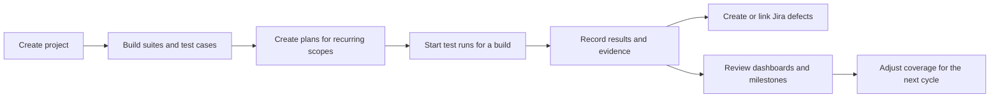

# Karvio Documentation

Karvio is a self-hosted test management system for QA teams that need one place for manual testing, automated result imports, release readiness, Jira defects, audit history, and performance evidence.

Start with installation if you are deploying Karvio. Start with Quick Start if the application is already running and you want to validate the core workflow.

---

## Product Areas

| Area | Use it to |
|------|-----------|
| **Test Cases** | Build a repository of reusable manual or automation-linked cases organized by suites, owners, priorities, tags, datasets, and attachments. |
| **Test Runs** | Execute selected cases against a build, environment, and milestone; record results, comments, step outcomes, evidence, and defects. |
| **Test Plans** | Save recurring scopes such as smoke, regression, release acceptance, or platform coverage plans and create runs from them quickly. |
| **Datasets** | Maintain versioned parameter data so one test case can cover multiple input combinations. |
| **Release Scope** | Model products, components, risk, milestones, and release-ready test plans in one place. |
| **Environments** | Record the exact target configuration used for execution, including browser, OS, URL, feature flags, and infrastructure details. |
| **Performance Testing** | Store load-test artifacts, import supported results, compare executions, and keep performance evidence with release data. |
| **Integrations** | Connect Jira and CI output so defects and automated results are tied to the same testing record. |
| **Project & Users** | Manage projects, users, roles, project membership, and audit controls. |

---

## Recommended Paths

For a first deployment:

1. [Installation](getting-started/installation.md) – deploy the application and create the first administrator.
2. [Key Concepts](getting-started/concepts.md) – understand how projects, suites, cases, plans, runs, milestones, and environments fit together.
3. [Quick Start](getting-started/quick-start.md) – create a project, add cases, execute a run, and review results.

For a QA team rollout:

1. [Test Cases](user-guide/test-cases/index.md) – design a maintainable case repository.
2. [Test Runs](user-guide/test-runs/index.md) – execute manual runs and record evidence.
3. [Release Scope](user-guide/release-scope/index.md) – connect coverage to products, components, milestones, and plans.
4. [Jira Integration](user-guide/integrations/jira.md) and [JUnit XML Import](user-guide/integrations/junit-xml.md) – connect defects and automation.

---

## Typical Team Workflow

---

## Administrator Guides

- [Projects](user-guide/project-users/projects.md) – create projects, define ownership, and understand deletion impact.
- [Users and Permissions](user-guide/project-users/users.md) – manage users, roles, and project membership.
- [Authorization](user-guide/api/authorization.md) – create secure credentials for CI and scripts.
- [Notifications](user-guide/notifications/index.md) – configure email, Slack, and project-level notification rules.

---

## Integration Guides

- [Jira](user-guide/integrations/jira.md) – create Jira connections, map projects, link issues, and create defects from failures.
- [JUnit XML Import](user-guide/integrations/junit-xml.md) – import automation results into existing or new runs.
- [API Reference](user-guide/api/index.md) – authenticate, paginate, inspect endpoints, and use example requests.
