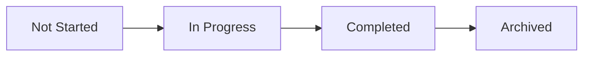

# Test Runs

Test Runs are execution sessions for a specific project, build, environment, and milestone. A test run records selected scope, run item status, result history, linked defects, JUnit imports, and exportable reports.

## What This Section Covers

Test Runs support:

- release regression cycles;
- smoke checks after deployment;
- UAT and acceptance passes;
- CI result imports from JUnit XML;
- failure triage with Jira links;
- execution evidence for release review;
- comparison across builds and environment revisions.

## How to Think About a Test Run

A test run combines:

- **Execution scope**: which test cases must be executed for a goal such as release, hotfix, smoke, UAT, regression, or automation.
- **Execution evidence**: statuses, comments, actual results, dataset row snapshots, linked defects, logs, timestamps, build, and environment revision.

A test case answers what to check. A test plan answers which scope should be repeated. A test run answers what happened in this execution.

## Core Concepts

| Concept | Description |
| --- | --- |
| Test Run | Execution container with name, build, environment, milestone, status, and summary. |
| Run Item | A test case added to a specific run. The API entity is named `run_case`. |
| Run Case Row | Dataset-driven execution row inside a run item. |
| Result | A status update with comment, actual result, defect references, and timestamps. |
| Environment Revision | Environment snapshot captured when the run is linked to an environment. |
| JUnit Import | Import of automation results into an existing or project-selected run. |

## Run Lifecycle

| Status | Meaning | UI Actions |
| --- | --- | --- |
| `not_started` | Run is created but execution has not started. | Start, Add Test Cases, Import JUnit, Export. |
| `in_progress` | Execution is active. | Complete, Add Test Cases, Add Result, Import JUnit, Export. |
| `completed` | Execution is closed. | Archive, Export. Run item updates are blocked. |
| `archived` | Historical run hidden from active work by filters. | Export. Run item updates are blocked. |

The backend does not allow completion while any run item is still `in_progress`.

## Subsections

- [Test Runs List](list.md)
- [Create Runs](create.md)
- [Run Overview](overview.md)
- [Results and Imports](results.md)
- [Permissions and API](permissions-api.md)
- [Scenarios, Troubleshooting, and Practices](scenarios-troubleshooting-practices.md)
